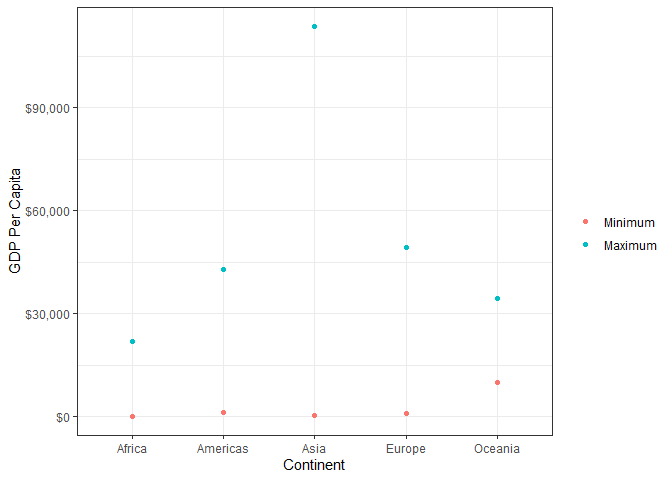

# Task Option 2


This task refers to finding the maximum and minimum GDP Per Capita for all continents. In the table below, the maximum and minimum GDP Per Capita was found for each continent, and the country and year that this GDP Per Capita value is related to is also stated in separate columns.


<!--html_preserve--><div id="htmlwidget-47011ecd807f4926208d" style="width:100%;height:auto;" class="datatables html-widget"></div>
<script type="application/json" data-for="htmlwidget-47011ecd807f4926208d">{"x":{"filter":"none","data":[["1","2","3","4","5"],["Africa","Americas","Asia","Europe","Oceania"],[241.2,1201.6,331,973.5,10039.6],["Congo, Dem. Rep.","Haiti","Myanmar","Bosnia and Herzegovina","Australia"],[2002,2007,1952,1952,1952],[21951.2,42951.7,113523.1,49357.2,34435.4],["Libya","United States","Kuwait","Norway","Australia"],[1977,2007,1957,2007,2007]],"container":"<table class=\"display\">\n  <thead>\n    <tr>\n      <th> <\/th>\n      <th>continent<\/th>\n      <th>gdpPercap_min<\/th>\n      <th>country_min<\/th>\n      <th>year_min<\/th>\n      <th>gdpPercap_max<\/th>\n      <th>country_max<\/th>\n      <th>year_max<\/th>\n    <\/tr>\n  <\/thead>\n<\/table>","options":{"columnDefs":[{"className":"dt-right","targets":[2,4,5,7]},{"orderable":false,"targets":0}],"order":[],"autoWidth":false,"orderClasses":false}},"evals":[],"jsHooks":[]}</script><!--/html_preserve-->


Graphs are powerful methods to communicate data. Let's look at the maximum and minimum GDP Per Capita for each continent, and see (with more ease) how each continent compares to each other.


<!-- -->

# Task Option 3


This task refers to the spread of GDP Per Capita within each continent. In the table below, the average GDP Per Capita (mu) for each continent can be found along with the standard deviation of the GDP Per Capita (sigma) for each continent.


<!--html_preserve--><div id="htmlwidget-404e9a53a0ab4e7bfc7c" style="width:100%;height:auto;" class="datatables html-widget"></div>
<script type="application/json" data-for="htmlwidget-404e9a53a0ab4e7bfc7c">{"x":{"filter":"none","data":[["1","2","3","4","5"],["Africa","Americas","Asia","Europe","Oceania"],[2193.8,7136.1,7902.2,14469.5,18621.6],[2827.9,6396.8,14045.4,9355.2,6359]],"container":"<table class=\"display\">\n  <thead>\n    <tr>\n      <th> <\/th>\n      <th>continent<\/th>\n      <th>mu<\/th>\n      <th>sigma<\/th>\n    <\/tr>\n  <\/thead>\n<\/table>","options":{"columnDefs":[{"className":"dt-right","targets":[2,3]},{"orderable":false,"targets":0}],"order":[],"autoWidth":false,"orderClasses":false}},"evals":[],"jsHooks":[]}</script><!--/html_preserve-->


However, to get a better idea of the spread, it is easier to represent the raw data on a few different graphs. The first figure below is a ridge plot showing the data relative to each continent, and the second figure below shows box plots of each continent, which include the minimum, first quantile, median, third quantile, and maximum values for each continent.


```
## Picking joint bandwidth of 1650
```

<!-- --><!-- -->

# Task Option 5


This task refers to the average life expectancy within each continent and shows how it is changing over time. The table below shows how the average life expectancy changes within each continent for each year.


<!--html_preserve--><div id="htmlwidget-fb4a8287131a7bcff814" style="width:100%;height:auto;" class="datatables html-widget"></div>
<script type="application/json" data-for="htmlwidget-fb4a8287131a7bcff814">{"x":{"filter":"none","data":[["1","2","3","4","5","6","7","8","9","10","11","12","13","14","15","16","17","18","19","20","21","22","23","24","25","26","27","28","29","30","31","32","33","34","35","36","37","38","39","40","41","42","43","44","45","46","47","48","49","50","51","52","53","54","55","56","57","58","59","60"],["Africa","Africa","Africa","Africa","Africa","Africa","Africa","Africa","Africa","Africa","Africa","Africa","Americas","Americas","Americas","Americas","Americas","Americas","Americas","Americas","Americas","Americas","Americas","Americas","Asia","Asia","Asia","Asia","Asia","Asia","Asia","Asia","Asia","Asia","Asia","Asia","Europe","Europe","Europe","Europe","Europe","Europe","Europe","Europe","Europe","Europe","Europe","Europe","Oceania","Oceania","Oceania","Oceania","Oceania","Oceania","Oceania","Oceania","Oceania","Oceania","Oceania","Oceania"],[1952,1957,1962,1967,1972,1977,1982,1987,1992,1997,2002,2007,1952,1957,1962,1967,1972,1977,1982,1987,1992,1997,2002,2007,1952,1957,1962,1967,1972,1977,1982,1987,1992,1997,2002,2007,1952,1957,1962,1967,1972,1977,1982,1987,1992,1997,2002,2007,1952,1957,1962,1967,1972,1977,1982,1987,1992,1997,2002,2007],[39.1,41.3,43.3,45.3,47.5,49.6,51.6,53.3,53.6,53.6,53.3,54.8,53.3,56,58.4,60.4,62.4,64.4,66.2,68.1,69.6,71.2,72.4,73.6,46.3,49.3,51.6,54.7,57.3,59.6,62.6,64.9,66.5,68,69.2,70.7,64.4,66.7,68.5,69.7,70.8,71.9,72.8,73.6,74.4,75.5,76.7,77.6,69.3,70.3,71.1,71.3,71.9,72.9,74.3,75.3,76.9,78.2,79.7,80.7]],"container":"<table class=\"display\">\n  <thead>\n    <tr>\n      <th> <\/th>\n      <th>continent<\/th>\n      <th>year<\/th>\n      <th>lifeExp_avg<\/th>\n    <\/tr>\n  <\/thead>\n<\/table>","options":{"columnDefs":[{"className":"dt-right","targets":[2,3]},{"orderable":false,"targets":0}],"order":[],"autoWidth":false,"orderClasses":false}},"evals":[],"jsHooks":[]}</script><!--/html_preserve-->


The table above is fairly large, so to better grasp the data, the graph below shows how the average life expectancy has been changing through time.


<!-- -->

