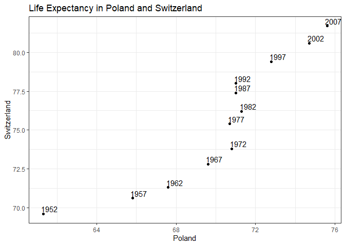

# Exercise 1 - Univariate Option 1

Let's take a look at the life expectancy of two countries, such as Poland and Switzerland, for each year. Note that in the table below, the values have been rounded and are given in the unit "years".

  

To get a better idea of how the life expectancies of the two countries are changing relative to each other, let's graph them against each other since visuals are powerful communication tools.

<!-- -->

We can see that the life expectancy in Poland stagnates between 1972 and 1992 while it continues to increase in Switzerland.

Now let's return the data back to the format found in the gapminder dataset, where observations are listed for each country and arranged by country followed by year.

  

# Exercise 2 - Multivariate Option 1

After reviewing the life expectancy of Poland and Switzerland for each year, let's see how the GDP per capita changes with life expectancy. Note that in the table below, the values have been rounded and are given in the unit "years" for life expectancy or "dollars" for GDP per capita.

  

Now that we've seen how GDP per capita compares to life expectancy for both Poland and Switzerland, let's return the data back to the format found in the gapminder dataset, where observations are listed for each country and arranged by country followed by year.

  

#Exercise 3

