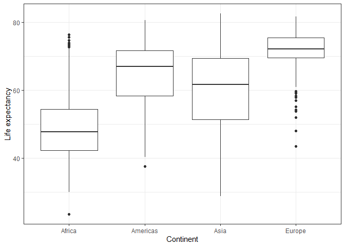
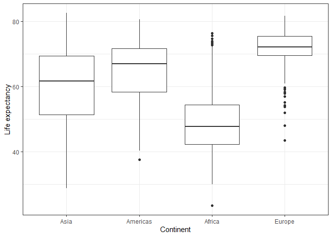

Before we begin, let us load some packages that we will potentially be using. For this assignment, we will be wrangling part of the gapminder dataset.


```r
library(gapminder)
library(tidyverse)
library(dplyr)
library(forcats)
library(ggplot2)
library(tibble)
library(DT)
```

# Exercise 1 

The *here::here* package in RStudio projects is a great package that has its primary advantages when sharing code with collaborators. When using other methods to specify the directory in your code, the code may malfunction due to the collaborators using different operating systems. This package also replaces the need to specify the working directory in the code, which again would cause the code to malfunction if collaborators are trying to run the code without having the same file path expressed on their computer. Other advantages to the package include the ease in which sub-directories can be managed and even used if the files are opened outside of a project on RStudio. 

# Exercise 2

## Part 1

Let's explore the gapminder dataset. Before beginning, let's verify that a variable within the dataset, such as continent, is a factor.


```r
gapminder$continent %>%
  class()
```

```
## [1] "factor"
```

The variable continent is indeed a factor.

Let's look at how many levels there are within this factor, and let's identify the different levels.


```r
gapminder$continent %>%
  nlevels()
```

```
## [1] 5
```

```r
gapminder$continent %>%
  levels()
```

```
## [1] "Africa"   "Americas" "Asia"     "Europe"   "Oceania"
```

There are 5 levels, which are listed above; the number of entries for each continent can be found in the table below.


```r
gapminder %>%
  count(continent) %>%
  datatable()
```

<!--html_preserve--><div id="htmlwidget-0a4101562af44f416d61" style="width:100%;height:auto;" class="datatables html-widget"></div>
<script type="application/json" data-for="htmlwidget-0a4101562af44f416d61">{"x":{"filter":"none","data":[["1","2","3","4","5"],["Africa","Americas","Asia","Europe","Oceania"],[624,300,396,360,24]],"container":"<table class=\"display\">\n  <thead>\n    <tr>\n      <th> <\/th>\n      <th>continent<\/th>\n      <th>n<\/th>\n    <\/tr>\n  <\/thead>\n<\/table>","options":{"columnDefs":[{"className":"dt-right","targets":2},{"orderable":false,"targets":0}],"order":[],"autoWidth":false,"orderClasses":false}},"evals":[],"jsHooks":[]}</script><!--/html_preserve-->

There are relatively few entries for Oceania, so let's remove Oceania from the dataset. First, let's filter through the dataset to remove observations from Oceania.


```r
Ex2 <- c("Africa", "Americas", "Asia", "Europe")
Ex2_filter <- gapminder %>%
  filter(continent %in% Ex2)

Ex2_filter %>%
  count(continent) %>%
  datatable()
```

<!--html_preserve--><div id="htmlwidget-d4437368cd6629304333" style="width:100%;height:auto;" class="datatables html-widget"></div>
<script type="application/json" data-for="htmlwidget-d4437368cd6629304333">{"x":{"filter":"none","data":[["1","2","3","4"],["Africa","Americas","Asia","Europe"],[624,300,396,360]],"container":"<table class=\"display\">\n  <thead>\n    <tr>\n      <th> <\/th>\n      <th>continent<\/th>\n      <th>n<\/th>\n    <\/tr>\n  <\/thead>\n<\/table>","options":{"columnDefs":[{"className":"dt-right","targets":2},{"orderable":false,"targets":0}],"order":[],"autoWidth":false,"orderClasses":false}},"evals":[],"jsHooks":[]}</script><!--/html_preserve-->

```r
Ex2_filter$continent %>%
  nlevels()
```

```
## [1] 5
```

```r
Ex2_filter$continent %>%
  levels()
```

```
## [1] "Africa"   "Americas" "Asia"     "Europe"   "Oceania"
```

Oceania was successfully filtered from the dataset! However, we can see that the number of levels didn't change, and Oceania is still listed as a level; Oceania is now considered an unused level. Let's drop this unused level.


```r
Ex2_dropped <- Ex2_filter %>% 
  droplevels()

Ex2_dropped$continent %>%
  nlevels()
```

```
## [1] 4
```

```r
Ex2_dropped$continent %>%
  levels()
```

```
## [1] "Africa"   "Americas" "Asia"     "Europe"
```

We successfully dropped the unused levels, and Oceania is no longer listed as a level.

## Part 2

Now that we have removed Oceania, let's look at the standard deviation of life expectancy in the remaining data and display them in a visual manner using boxplots.


```r
Ex2_P2 <- Ex2_dropped %>%
  group_by(continent) %>%
  summarize(sigma = sd(lifeExp))

Ex2_P2_r = Ex2_P2
Ex2_P2_r$sigma = round(Ex2_P2_r$sigma, 1)

datatable(Ex2_P2_r)
```

<!--html_preserve--><div id="htmlwidget-a04a5b3deb36f987f2e1" style="width:100%;height:auto;" class="datatables html-widget"></div>
<script type="application/json" data-for="htmlwidget-a04a5b3deb36f987f2e1">{"x":{"filter":"none","data":[["1","2","3","4"],["Africa","Americas","Asia","Europe"],[9.2,9.3,11.9,5.4]],"container":"<table class=\"display\">\n  <thead>\n    <tr>\n      <th> <\/th>\n      <th>continent<\/th>\n      <th>sigma<\/th>\n    <\/tr>\n  <\/thead>\n<\/table>","options":{"columnDefs":[{"className":"dt-right","targets":2},{"orderable":false,"targets":0}],"order":[],"autoWidth":false,"orderClasses":false}},"evals":[],"jsHooks":[]}</script><!--/html_preserve-->


```r
Ex2_dropped %>%
  select(continent, lifeExp) %>%
  arrange(continent) %>%
  ggplot(aes(continent, lifeExp)) +
    geom_boxplot() +
    ylab("Life expectancy") +
    xlab("Continent") +
    theme_bw()
```

<!-- -->

Let's reorder the boxplots based on the standard deviation.


```r
Ex2_dropped %>%
  select(continent, lifeExp) %>%
  arrange(continent) %>%
  ggplot(aes(fct_relevel(continent, "Asia", "Americas", "Africa", "Europe"), lifeExp)) +
    geom_boxplot() +
    ylab("Life expectancy") +
    xlab("Continent") +
    theme_bw()
```

<!-- -->

Now the boxes become tighter from left to right!

# Exercise 3

Let's create a dataset with only data from Poland. Only data about the year, life expectancy, population, and GDP per capita will be kept since the country and continent will be redundant.


```r
Poland <- gapminder %>%
  filter(country == "Poland") %>%
  select(year, lifeExp, pop, gdpPercap)

write_csv(Poland, here::here("hw05", "Poland.csv"))
```

Now that we have created a CSV file in our working directories, let's read in that CSV file so we can see the data!


```r
Poland_file = here::here("hw05", "Poland.csv")

Poland_new <- read_csv(Poland_file)
datatable(Poland_new)
```

<!--html_preserve--><div id="htmlwidget-64e99f0a43db362bb3cb" style="width:100%;height:auto;" class="datatables html-widget"></div>
<script type="application/json" data-for="htmlwidget-64e99f0a43db362bb3cb">{"x":{"filter":"none","data":[["1","2","3","4","5","6","7","8","9","10","11","12"],[1952,1957,1962,1967,1972,1977,1982,1987,1992,1997,2002,2007],[61.31,65.77,67.64,69.61,70.85,70.67,71.32,70.98,70.99,72.75,74.67,75.563],[25730551,28235346,30329617,31785378,33039545,34621254,36227381,37740710,38370697,38654957,38625976,38518241],[4029.329699,4734.253019,5338.752143,6557.152776,8006.506993,9508.141454,8451.531004,9082.351172,7738.881247,10159.58368,12002.23908,15389.92468]],"container":"<table class=\"display\">\n  <thead>\n    <tr>\n      <th> <\/th>\n      <th>year<\/th>\n      <th>lifeExp<\/th>\n      <th>pop<\/th>\n      <th>gdpPercap<\/th>\n    <\/tr>\n  <\/thead>\n<\/table>","options":{"columnDefs":[{"className":"dt-right","targets":[1,2,3,4]},{"orderable":false,"targets":0}],"order":[],"autoWidth":false,"orderClasses":false}},"evals":[],"jsHooks":[]}</script><!--/html_preserve-->

# Exercise 4

Many figures were created while completing previous assignments. However, in light of recent developments, let's go back to Assignment# and recreate the figure from Task#, showing both the original figure with the new figure side-by-side.


REFLECTIONS ON DIFFERENCES----

# Exercise 5

Let's save the new plot that we just made in *Exercise 4* as a separate file.


